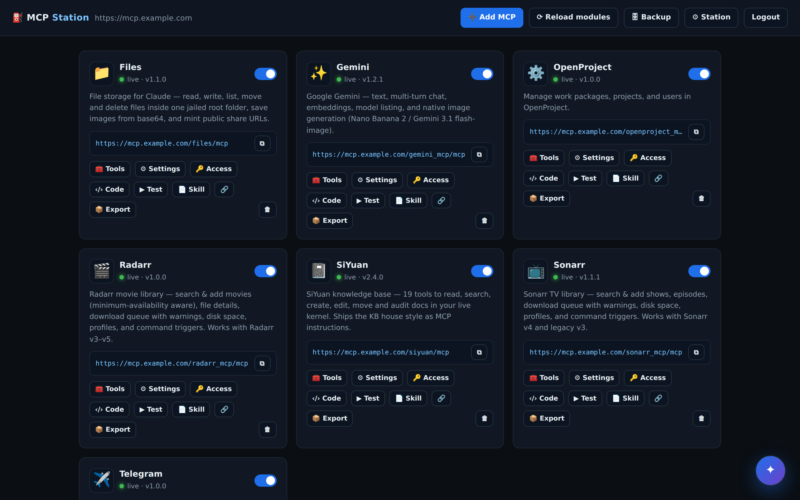
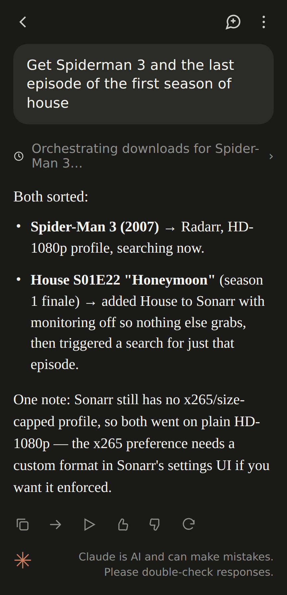
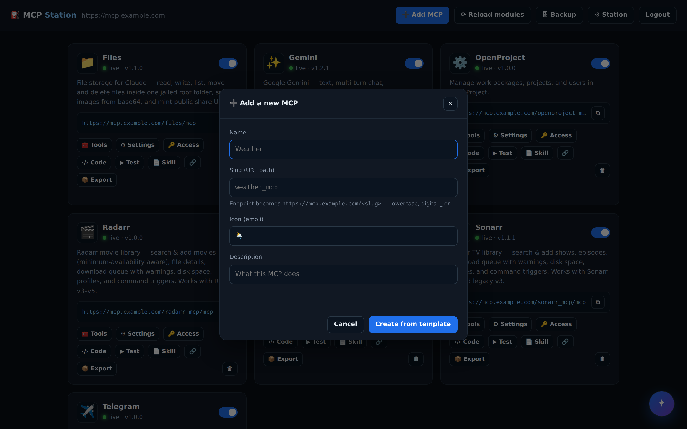
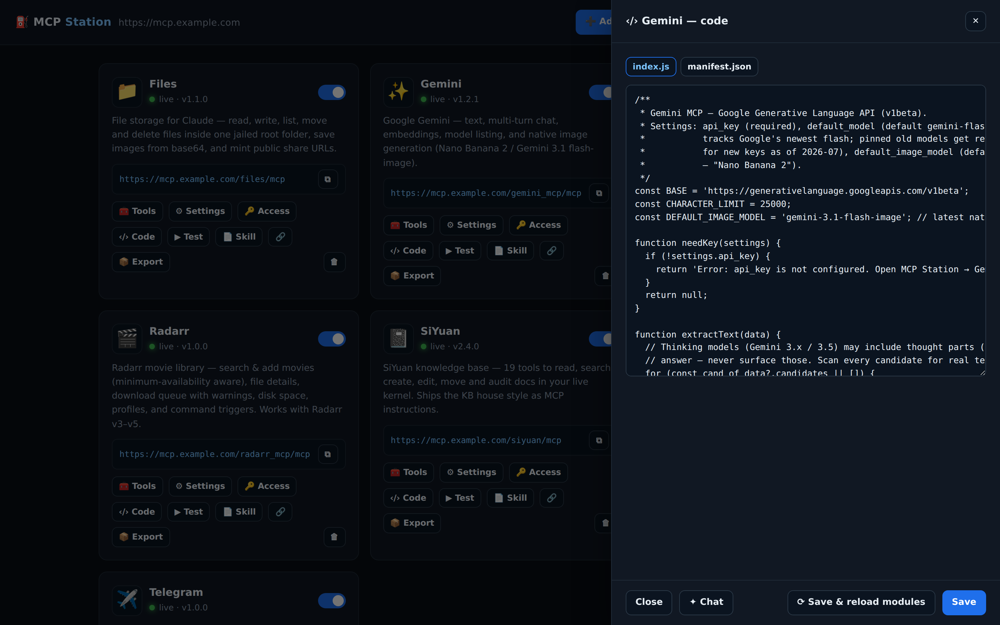
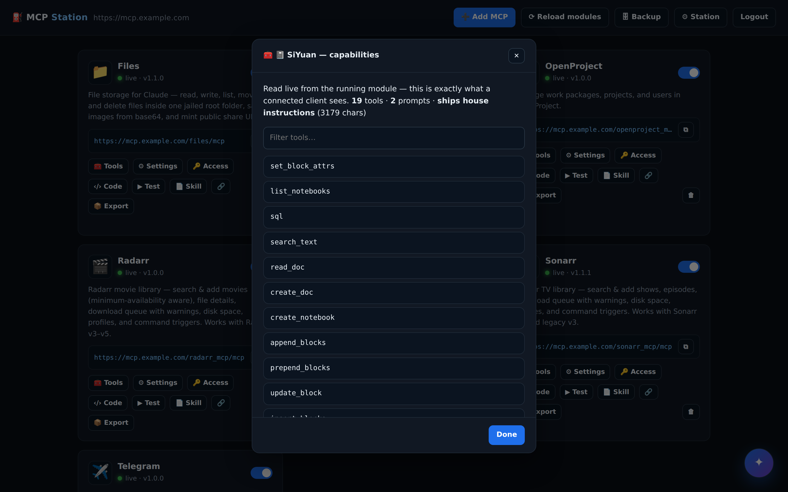
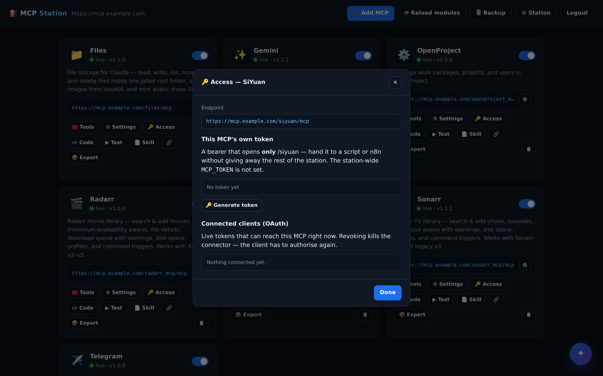
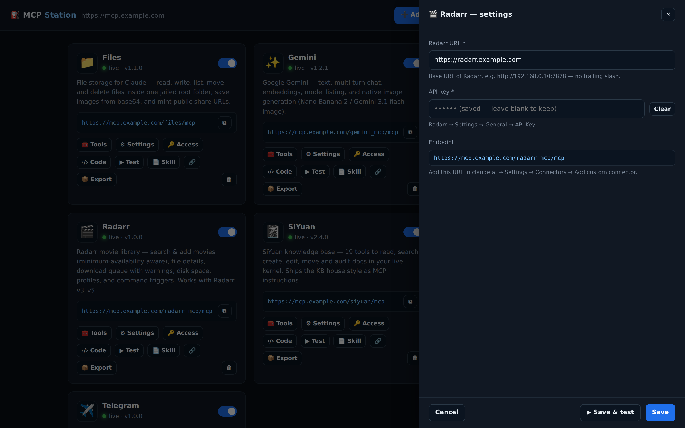
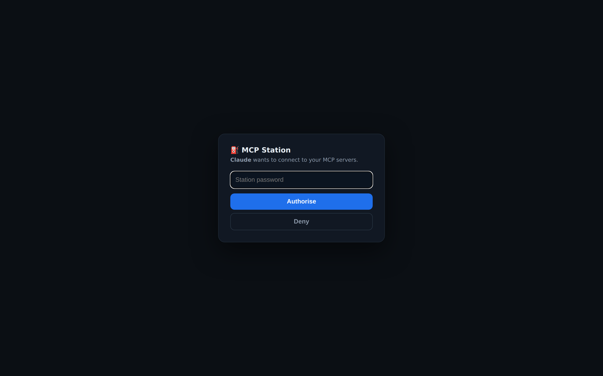

<p align="center"></p>

<h1 align="center">MCP Station</h1>

<p align="center"><b>Turn any API into an MCP server that claude.ai can use — self-hosted, in one container.</b></p>

<p align="center">
  
  =20">
  
  
</p>

<p align="center"></p>

MCP Station is a self-hosted hub that hosts each folder in `mcps/` as a remote MCP endpoint at
`https://your-host/<module>/mcp`. It connects to **claude.ai (web + mobile + desktop)** as a custom
connector, to **Claude Code** via bearer token, and to any other MCP client that speaks streamable
HTTP. One container, one password, unlimited MCPs.

```
https://mcp.example.com/siyuan/mcp        → SiYuan knowledge base MCP  📓
https://mcp.example.com/files/mcp         → jailed file storage        📁
https://mcp.example.com/gemini_mcp/mcp    → Google Gemini MCP          ✨
https://mcp.example.com/xero/mcp          → your accounting, your tools 💷
https://mcp.example.com/<anything>/mcp    → whatever you build next    🪄
```

---

## The big idea: give Claude access to *your* world

Every SaaS, home-lab service and internal API has a REST endpoint. Very few ship an MCP — and the
ones that do only expose what the vendor decided to build. **MCP Station flips that around: if it
speaks HTTP, you can turn it into an MCP yourself, expose exactly the tools you need, and hand them
to Claude.** Your keys and data never leave your box.

- **No official MCP? Build one.** Radarr, Sonarr, your NAS, a POS system, an RSS feed, your
  smart-home hub, a database, an internal microservice — none of these ship a connector. With MCP
  Station they become one in minutes.
- **An official MCP that doesn't fit? Roll your own.** Even for services that *do* have a connector,
  a module you build is shaped to *your* workflow. Concrete example — the official **Xero** connector
  in Claude's directory gives you **7 tools, read-only**: cash position, P&L, receivables, top
  customers. Great for *"what's my financial position?"*, but it's a viewer. The **bundled** Xero
  module runs **31 tools, read *and* write** — 21 to list/report across accounts, invoices, payments,
  employees, timesheets, **pay runs** and tracking categories, plus 10 to actually *do* things:
  create invoices, take payments, raise credit notes, book employee leave, update contacts. Built
  from Xero's API docs in an afternoon, self-hosted, using your own keys.

  | | Official Xero connector | Bundled module |
  |---|---|---|
  | Tools | 7 | **31** |
  | Access | read-only | read **+ write** |
  | Can it raise an invoice / take a payment / run payroll? | no | **yes** |
  | Runs on | vendor's cloud | **your box, your keys** |

- **Give yourself more access, safely.** Per-MCP tokens, per-MCP OAuth scoping, and encrypted
  settings mean you decide exactly which module a given client can reach.

> More tools isn't automatically better — the official connector is read-only *by design*, which is
> the safe default. The point is you're never limited to what someone else shipped: when the shop
> needs Claude to actually raise the invoice, you build the module that does it, and it runs on
> hardware you control.

---

## How it works in practice

The real workflow, start to finish — usually a few minutes per integration:

1. **Open the chat.** Either the station's built-in **✦ assistant** (bottom-right of the admin UI)
   or Claude itself.
2. **Paste in the API.** The REST/API docs URL, an OpenAPI spec, or just a list of endpoints and a
   couple of example `curl` calls — whatever you have.
3. **Create a temporary API key** for the service.
4. **Tell it to build the module and test it** with that temp key — the assistant writes
   `manifest.json` + `index.js`, and the station's **▶ Test** button hits the real API to confirm it
   works.
5. **Swap in a real key**, toggle the module on — it's now a live endpoint at `/<slug>/mcp`.
6. **Add it to Claude** as a custom connector (paste the URL, approve with your station password) and
   **download the generated skill** (📄 Skill) into claude.ai.
7. **Tell Claude to tweak the skill** to match how *you* work. (For the Radarr/Sonarr modules, that
   meant "only grab releases under a set size, x265/HEVC" — baked right into the skill so every
   request follows the rule.)

That's it. An API you were reading the docs for at the start of a coffee is a tool Claude can call by
the end of it.

---

## See it in action

Ask in plain English; the modules do the work. A real request from a phone:

<p align="center"></p>

One message — *"Get Spiderman 3 and the last episode of the first season of house"* — and the Radarr and
Sonarr modules add the right film, resolve the season-1 finale, add the show with monitoring off so nothing
else grabs, and trigger a search for just that episode. It even flags, honestly, that the x265 size rule
isn't set up in Sonarr yet.

---

## 🪄 AI-generated MCPs — the assistant writes the module for you

You don't have to write modules by hand. The built-in **✦ assistant** (Claude or Gemini) lives in
the station UI, knows the exact module contract, and sees the station's live context — so you can
open ➕ **Add MCP**, describe what you want, and paste in whatever you have (API docs, an OpenAPI
spec, example `curl` calls, an existing script). It writes the complete module — `manifest.json`
with a settings form for the API keys, `index.js` with typed tools, descriptions Claude understands
— straight into the in-browser editor. **⤵ Insert**, toggle it on, and it's a live MCP endpoint you
can add to claude.ai thirty seconds later. Hot reload, no rebuilds, no SDK boilerplate, no local
tooling. **If it speaks HTTP, it can be an MCP.**

<p align="center">
  
  &nbsp;
  
</p>

---

## Features

- **Turn any API into an MCP** — if it speaks HTTP, it becomes a tool Claude can call.
- **AI-assisted module builder** — paste API docs, an OpenAPI spec, or a few `curl` calls and the
  built-in ✦ assistant writes the whole module into the browser editor.
- **Modules are just folders** — `manifest.json` + `index.js`, hot-reloaded, no rebuilds or restarts.
  Copy `_template`, or let the assistant write one.
- **OAuth 2.1 built in** — claude.ai (web, mobile, desktop) connects by URL alone: discovery, dynamic
  client registration, PKCE S256, rotating refresh tokens, and a password-gated consent page with an
  explicit **Deny**.
- **Three auth lanes** — a station-wide `MCP_TOKEN` (master), per-module tokens (hand out one
  endpoint), and per-MCP-scoped OAuth (a token for `/siyuan` is refused at `/gemini_mcp`).
- **Encrypted secrets** — module settings are AES-256-GCM at rest, masked in the UI, never echoed back.
- **In-browser code editor** — edit a module and hot-reload it without touching the server.
- **Live capabilities inspector** — see exactly what tools a module exposes before you trust it.
- **📦 Module sharing** — export any module as a `.zip` (secrets stripped); drop it into anyone else's
  station and it runs.
- **One-click Claude skill export** — download a ready-made skill for any module.
- **Backups & logs** — JSON import/export, one-click tar.gz snapshots, and a live log of every OAuth
  and MCP request.
- **Self-hosted, one container** — Docker / Unraid / TrueNAS; no build step, three runtime deps, no
  cloud dependency.

## What you can do with it

- **Give Claude access to things with no official connector** — Radarr, Sonarr, your NAS, a POS, an
  RSS feed, a smart-home hub, a database, an internal API.
- **Build a connector shaped to your workflow** — e.g. the bundled Xero module's 31 read+write tools
  vs the official connector's 7 read-only ones.
- **Run your media library by voice** — *"get spider man 2"* → added to Radarr, searching, with your
  quality rules (size, x265) baked into the skill.
- **Let Claude read and write your knowledge base** — search, file, tag and link notes (SiYuan).
- **Run business tasks from chat** — raise invoices, take payments, book staff leave, run payroll,
  pull a P&L.
- **Give Claude a place to work** — read/write files in a jailed folder, save images, mint share links.
- **Get notified** — have Claude send Telegram messages, or wire it into a workflow.
- **Connect from anywhere** — claude.ai web / mobile / desktop, Claude Code, or any MCP client.
- **Hand out narrow access** — give a script one module's endpoint without the keys to everything.
- **Share what you build** — pass a module to a mate or the community as a single `.zip`.

## 📦 Bundled modules

These ship in `mcps/` and are seeded on first boot — they're just folders, so delete what you don't
want and build what's missing:

| Module | Slug | Tools | What it does |
|---|---|---|---|
| 📁 Files | `files` | 10 | Jailed file storage for Claude — read/write/move files, save images from base64, mint public share links |
| ✨ Gemini | `gemini_mcp` | 6 | Google Gemini — text, chat, embeddings, native image generation (Nano Banana 2) |
| ⚙️ OpenProject | `openproject_mcp` | 14 | Work packages (incl. parent nesting), projects & sub-projects, users, statuses, types |
| 🎬 Radarr | `radarr_mcp` | 9 | Movie library — search & add (availability-aware), queue with warnings, disk space, command triggers |
| 📓 SiYuan | `siyuan` | 19 | SiYuan knowledge base — read, search, create, edit, move and audit docs |
| 📺 Sonarr | `sonarr_mcp` | 9 | TV library — search & add shows, episodes, queue with warnings, disk space, command triggers |
| ✈️ Telegram | `telegram_mcp` | 5 | Send and read Telegram messages through a bot |
| 🧾 Xero | `xero_mcp` | 31 | Accounting + payroll — invoices, quotes, payments, credit notes, bank transactions, items, live reports, employees, leave, timesheets, pay runs (Xero Custom Connection) |

(`_template` is the scaffold ➕ Add MCP copies — it isn't served as an endpoint.)

## Screens

| | |
|---|---|
| **Live capabilities inspector** — what a client actually sees, read from the running module | **Per-module access** — its own token + the OAuth connections that can reach it |
|  |  |
| **Encrypted per-module settings** — secrets masked, AES-256-GCM at rest | **claude.ai consent** — one password, per-MCP scope, explicit Deny |
|  |  |

---

## Quick start (Docker Compose)

```yaml
services:
  mcp-station:
    image: dbzocchi/mcp-station:latest
    container_name: mcp-station
    restart: unless-stopped
    ports:
      - "8788:8788"
    environment:
      APP_PASSWORD: change-me                 # admin UI login + OAuth consent password
      PUBLIC_URL: https://mcp.example.com     # your public HTTPS hostname — see rules below
      MCP_TOKEN: ""                           # optional static bearer for Claude Code / scripts
      COOKIE_SECURE: "1"                      # you are behind HTTPS
    volumes:
      - ./data:/data                          # state, OAuth store, encryption key — MUST persist
      - ./mcps:/app/mcps                      # module folders (seeded on first boot)
```

```bash
docker compose up -d
curl http://localhost:8788/healthz   # → {"ok":true,"version":"…","modules":8,"oauth":true}
```

Open `http://host:8788`, log in with `APP_PASSWORD`, configure each module's settings (e.g. the
SiYuan module needs your SiYuan URL + API token — **settings live in the UI, not in env vars**).

### The three `PUBLIC_URL` rules

`PUBLIC_URL` is the OAuth **issuer**. Connectors break in confusing ways when it's wrong:

1. It must be the **exact public HTTPS origin** clients connect to — scheme + hostname, no path.
   `https://mcp.example.com` ✅ · trailing slash is fine (stripped) · a different hostname than the
   one in the connector URL ❌
2. If you **change the hostname later**, change `PUBLIC_URL` and restart — a connector URL on host A
   with an issuer claiming host B fails authorization by design.
3. It must reach the station **directly** — no auth wall, no redirect in front of it. The station
   self-checks this at boot and logs the result.

---

## Connecting clients

**claude.ai (web / mobile / desktop) — permanent, OAuth:**
Settings → Connectors → **Add custom connector** → `https://mcp.example.com/<module>/mcp` → a popup
shows the station's consent page → enter `APP_PASSWORD` → connected. Tokens are scoped to that one
module and refresh automatically (1 h access, rotating refresh).

**Claude Code CLI — static token:**

```bash
claude mcp add --transport http siyuan https://mcp.example.com/siyuan/mcp \
  --header "Authorization: Bearer <MCP_TOKEN or per-module token>"
```

**Anything else** that speaks MCP streamable HTTP: same URL, same bearer header. The bare `/<module>`
path (no `/mcp` suffix) also works and is kept for backwards compatibility.

**Testing the full claude.ai flow without claude.ai** (discovery → registration → PKCE → consent →
token → tools):

```bash
node scripts/claude-flow-sim.mjs https://mcp.example.com /siyuan/mcp '<APP_PASSWORD>'
# FLOW OK — server + transport are healthy end to end
```

---

## Sharing modules

Built something good? Hand it over. On any module card, **📦 Export** downloads a `.zip` of the
module — its `manifest.json`, `index.js` and any docs — with the private bits (`.config.json`
encrypted settings, `.chat.json` assistant history) deliberately left out. On the other end:

```bash
unzip weather_mcp-module.zip -d /path/to/mcps/   # drop the folder into another station's mcps/
```

Hit **⟳ Reload modules** and it appears as a NEEDS SETTINGS module — the recipient adds their own
keys and it's live. This is how modules travel between stations and around the community. (The one
caveat: encrypted settings are tied to the station key, so a module always arrives *without* its
secrets — that's the point.)

---

## Unraid

Docker tab → **Add Container**:

| Field | Value |
|---|---|
| Repository | `dbzocchi/mcp-station:latest` |
| Network Type | Bridge |
| Port | `8788` → container `8788` |

**Paths** (add both — without persistent `/data` every connector dies on redeploy):

| Host path | Container path | Purpose |
|---|---|---|
| `/mnt/user/appdata/mcp-station/data` | `/data` | OAuth store, encrypted settings, key, backups |
| `/mnt/user/appdata/mcp-station/mcps` | `/app/mcps` | module folders (seeded on first boot) |
| `/mnt/user/mcp-files` (anywhere you like) | `/files` | the 📁 Files module's storage root — where Claude saves things |

**Variables:**

| Variable | Required | Example / notes |
|---|---|---|
| `APP_PASSWORD` | ✅ | admin login + OAuth consent password |
| `PUBLIC_URL` | ✅ for claude.ai | `https://mcp.example.com` — see the three rules above |
| `PORT` | — | `8788` (match the port mapping) |
| `MCP_TOKEN` | — | static bearer for Claude Code / scripts |
| `COOKIE_SECURE` | — | `1` when served over HTTPS |
| `SESSION_SECRET` | — | leave **unset** (a key is generated and persisted in `/data`). If you set it, pick the final value **before** configuring modules — changing it later makes encrypted settings unreadable |
| `FILES_DIR` | — | container path the 📁 Files module is jailed to (default `/files`); the module's `root_dir` UI setting overrides it. Map a host folder to this path |
| `ASSISTANT_PROVIDER` | — | `anthropic` or `gemini` (the ✦ assistant popup) |
| `ANTHROPIC_API_KEY` / `ANTHROPIC_MODEL` | — | assistant on Claude |
| `GEMINI_API_KEY` / `GEMINI_MODEL` | — | assistant on Gemini |

> Module settings such as a SiYuan URL/token are **not** env vars — set them in the station UI per
> module. They're stored encrypted in `/data` and mirrored into the module folder.

After starting: browse to `https://<your-hostname>` (or `http://<unraid-ip>:8788`) → log in →
configure modules. Check the container log's boot line: if it says the OAuth store loaded
`0 client(s)` after you previously had working connectors, your `/data` mapping isn't persisting.

---

## TrueNAS SCALE (custom app YAML)

Apps → **Discover Apps** → ⋮ → **Install via YAML**:

```yaml
services:
  mcp-station:
    image: dbzocchi/mcp-station:latest
    container_name: mcp-station
    restart: unless-stopped
    ports:
      - "8788:8788"
    environment:
      APP_PASSWORD: change-me
      PUBLIC_URL: https://mcp.example.com
      COOKIE_SECURE: "1"
      MCP_TOKEN: ""
    volumes:
      - /mnt/tank/apps/mcp-station/data:/data
      - /mnt/tank/apps/mcp-station/mcps:/app/mcps
```

Create the two datasets/directories first (`…/data`, `…/mcps`) and point the volumes at them.
Everything from the Unraid variable table applies unchanged.

---

## Cloudflare

Two things people ask about — putting the station behind Cloudflare, and how it relates to
Cloudflare's own MCP hosting. Both are covered in depth in **[docs/CLOUDFLARE.md](docs/CLOUDFLARE.md)**
(Cloudflare Tunnel setup, the AI-bot-blocking gotcha, and MCP Station vs Workers-hosted MCPs). The
one that bites everyone:

**If connectors fail *after* the password page** and the station log shows `token ISSUED` then
silence, it's almost always Cloudflare's **AI-bot blocking**. claude.ai's OAuth calls go out as a
generic client and pass, but its actual MCP data-plane calls identify as **`Claude-User`**, which
Cloudflare's managed "Manage AI bots" rule blocks at the edge with a 403 your origin never sees.

**Fix:** Cloudflare dashboard → your zone → **Security → Settings → Configure AI bot policies** → set
**Agent → Allow**. Then check **AI Crawl Control → Crawlers** (allow `Claude-User`) and
**Security → WAF → Custom rules**. Verify in **Security → Events** that connector attempts stop
logging `Manage AI bots / Block` for user-agent `Claude-User`. Full walkthrough in the Cloudflare
doc.

**Reverse proxy (SWAG / NPM / Caddy / plain nginx):** nothing special — a standard HTTPS `proxy_pass`
to `:8788` is all the station needs. No websocket config, no buffering tweaks, no `trust proxy`.

---

## Writing a module

A module is a folder in `mcps/`:

```
mcps/my-module/
├── manifest.json     # id, slug, name, icon, description, settings[]
├── index.js          # export function register({ server, z, getSettings, log, fetchJson })
└── instructions.md   # optional — served to every client as MCP instructions at initialize
```

`manifest.json` declares the URL slug and the settings form (types: `text`, `secret`, `select`,
`textarea` — secrets are encrypted at rest and masked in the UI). `register()` receives the MCP
`server` to add tools/prompts to, a zod instance `z` for schemas, `getSettings()` for live config,
and helpers. Copy `mcps/_template`, or open any module's ✦ Chat in the station UI and ask the
assistant to write one — it knows the contract. Full contract in
**[docs/BUILDING_MCPS.md](docs/BUILDING_MCPS.md)**.

Each module card shows 🧰 **Tools** (live capabilities inspection — what a client actually sees),
🔑 **Access** (per-module token + connected clients with revoke), and the code editor.

---

## Troubleshooting

| Symptom | Cause → fix |
|---|---|
| Password page works, then "Couldn't connect" / auth failed; log ends at `token ISSUED` | Cloudflare blocking `Claude-User` — see the Cloudflare section / doc |
| "Authorization with the MCP server failed" immediately | Hostname in the connector URL ≠ `PUBLIC_URL`, or a stale authorize page (>5 min old) — fix `PUBLIC_URL`/restart, retry fresh |
| "Couldn't register with the sign-in service" | Hostname doesn't resolve (DNS caching after a rename), or `/register` rate-limited after many attempts (20/h — restarting the container resets it) |
| Connectors die whenever you redeploy | `/data` isn't on a persistent volume — boot log says `0 client(s)` |
| Connector connects but every tool call errors "not configured" | Module settings are blank — set them in the station UI (not env vars) |
| Connect flow 404s before the password page | Wrong module slug in the URL — the 404 body lists the hosted MCPs, and unknown slugs are refused at discovery on purpose |
| Module responds 404 with a valid token | Module is toggled off in the UI |

The **Logs panel** (admin UI) records every OAuth endpoint response and every MCP request with
status, auth mode and user-agent — whatever a client does, it leaves a line. For a full client-side
re-enactment, run `scripts/claude-flow-sim.mjs` (above). More diagnostics in
**[docs/OAUTH.md](docs/OAUTH.md)**.

---

## Endpoints reference

| Surface | Path |
|---|---|
| MCP (canonical) | `POST /<slug>/mcp` — stateless streamable HTTP; `/<slug>` kept as alias |
| OAuth discovery | `/.well-known/oauth-authorization-server` · `/.well-known/oauth-protected-resource/<slug>/mcp` |
| OAuth flow | `/register` · `/authorize` · `/oauth/approve` · `/token` · `/revoke` |
| Health | `GET /healthz` → `{ok, version, modules, oauth}` |
| Admin UI / API | `/` · `/api/*` (session cookie, same-origin) |

Data lives in `/data` (`station.json` state + OAuth store, `secret.key`, `backups/`, `trash/`);
modules in `/app/mcps`. Backup = tar of both (or use the UI's backup button).

---

## Development & testing

No build step, no TypeScript — plain ESM, three runtime deps (`express`, `zod`, the MCP SDK).

```bash
npm install
APP_PASSWORD=test PUBLIC_URL=http://localhost:8788 node server/index.js

npm test                 # full smoke suite (auth, PKCE round-trip, MCP handshake, lifecycle)
npm run test:oauth       # OAuth 2.1 conformance + abuse suite
npm run test:scoping     # per-MCP token / OAuth scoping
npm run test:selfcontained  # delete-a-module-and-restore drill
```

Contributions welcome — see **[CONTRIBUTING.md](CONTRIBUTING.md)**. Security reports:
**[SECURITY.md](SECURITY.md)**. Roadmap: **[docs/ROADMAP.md](docs/ROADMAP.md)**.

## License

[MIT](LICENSE).
